# Configure Supervisor
## Versions
* VCF 9.0

## References
* [vSphere Supervisor Platform](https://techdocs.broadcom.com/us/en/vmware-cis/vcf/vcf-9-0-and-later/9-0/vsphere-supervisor-installation-and-configuration.html)

## Requirements
* VCF 9.0 deployed and configured
* vSAN ESA storage
* NSX edge networking and VPC configured
* Workload Control Plane (WCP) deployed using VPC

## Deployment Procedure

### 1. Login to vCenter
Login to vCenter with an account with administrator privileges. The account can either be local, or in VCF SSO.

Images

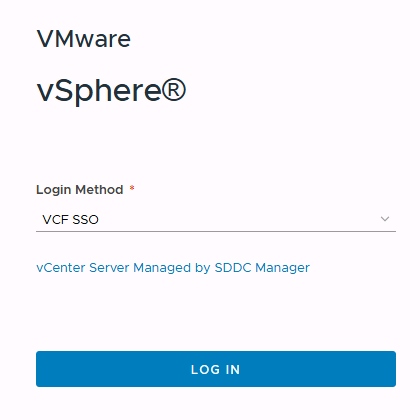

 
 

### 2. Select Supervisor Management
From the main vCenter page, open the manu, and select **Supervisor Management**. On the Supervisor Management page, select **New Namespace**.

Note. This step assumes the Supervisor Management is already deployed and configure.

Images

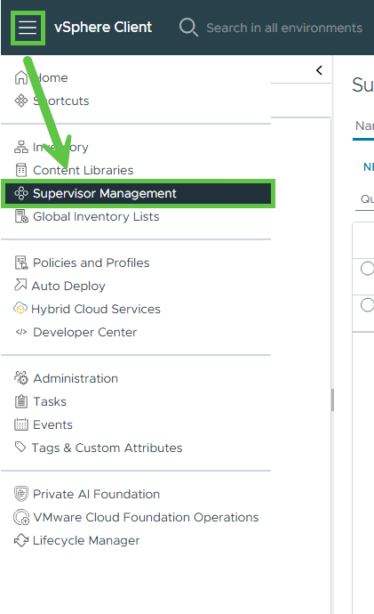

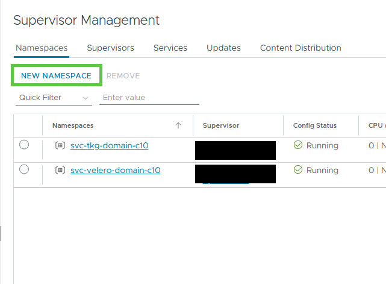

 
 

### 3. Create New Supervisor Namespace
On the Create Namespace window
1. On the **location** tab, select the available supervisor
2. On the **configuration** tab, enter a DNS compliant name.
3. On the **Add Zones** tab, select an available zone.
4. On the **Review** tab, ensure the information is correct, then click **Finish**.

Note. This step assumes the Supervisor Management is already deployed and configure.

Images

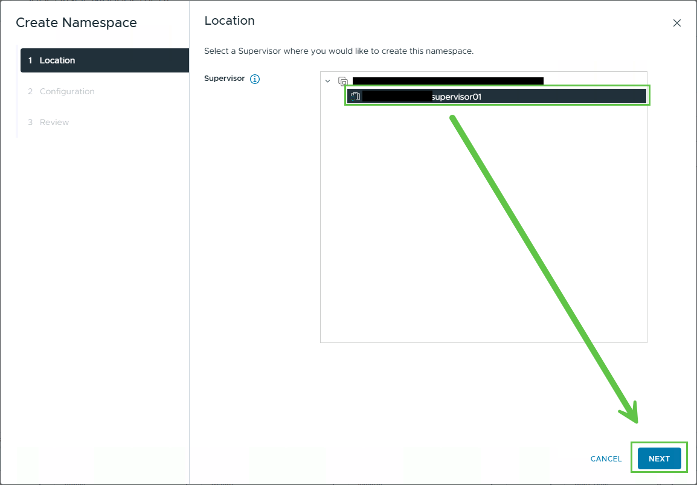

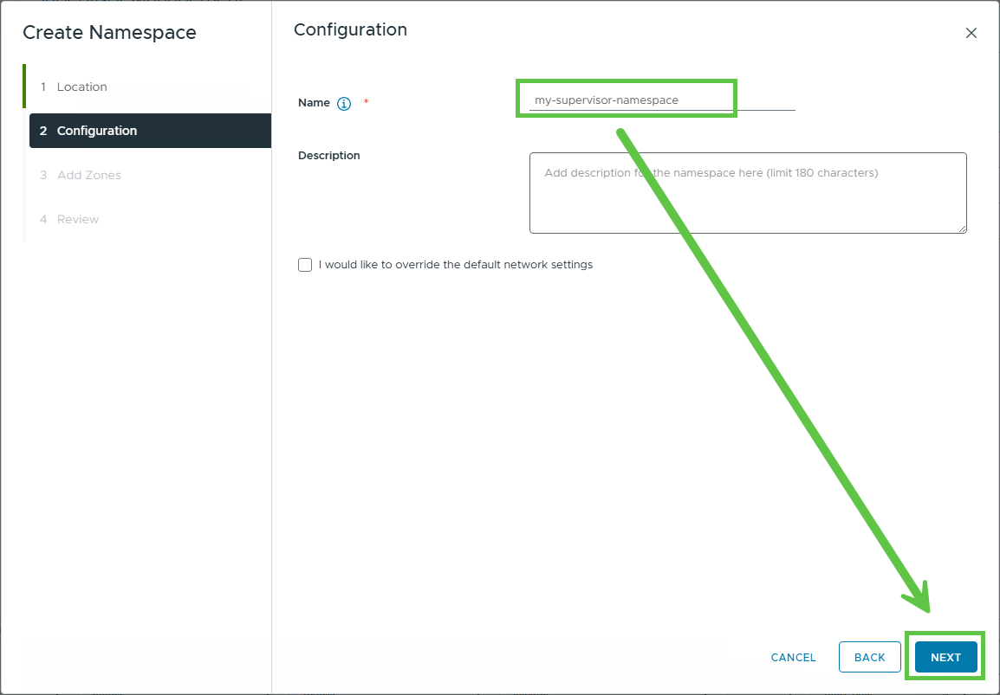

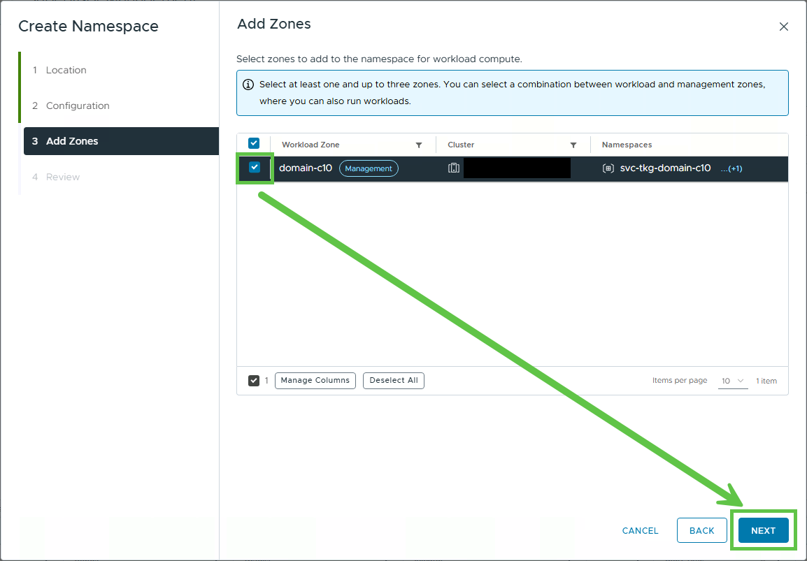

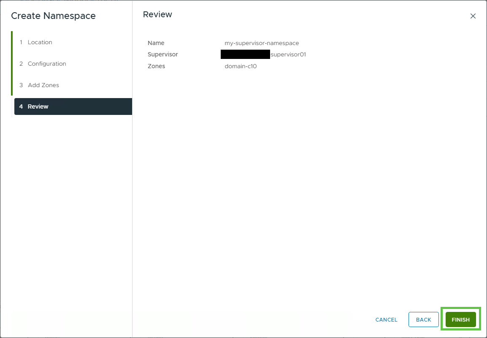

 
 

### 4. Configure Supervisor Namespace
In this step, we configure the new namespace with a minimal set of default options. Depending on the use case or environment, different or additional options may be required. 

1. Under **Namespaces**, select the new namespace.
2. On the new namespace summary page, locate the **Storage** panel, then select **Add Storage**.
3. In the **Select Storage Policies** window, select **vSAN ESA Default Policy - RAID5**.
4. Back on the new namespace summary page, the **Storage** panel should now indicate the selected storage policies.
5. On the new namespace summary page, locate the **VM Service** panel, then select **Add VM Class**.
6. In the **Add VM Class** window, select the following VM classes.
   * **best-effort-2xlarge**
   * **best-effort-medium**
7. Back on the new namespace summary page, the **VM Class** panel should indicate the number of associated VM Classes.

Images

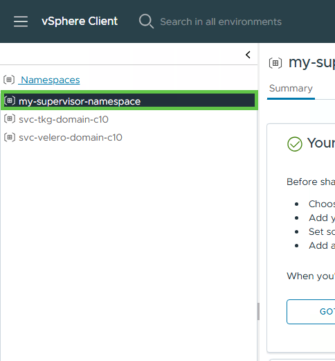

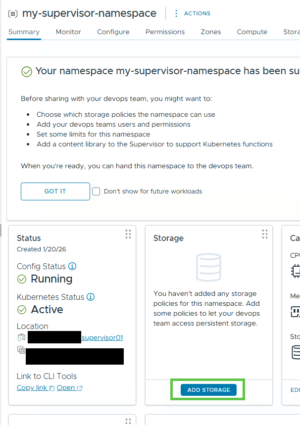

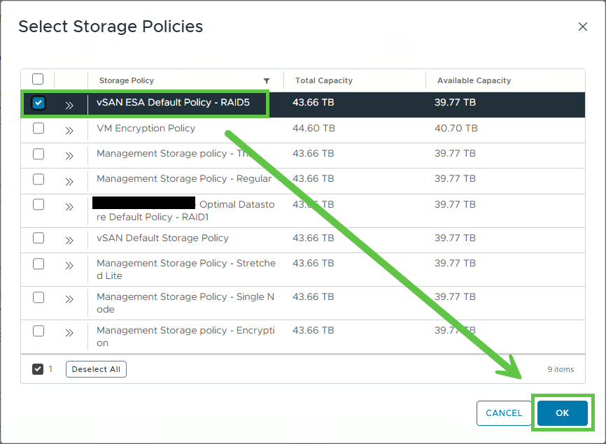

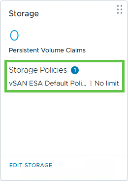

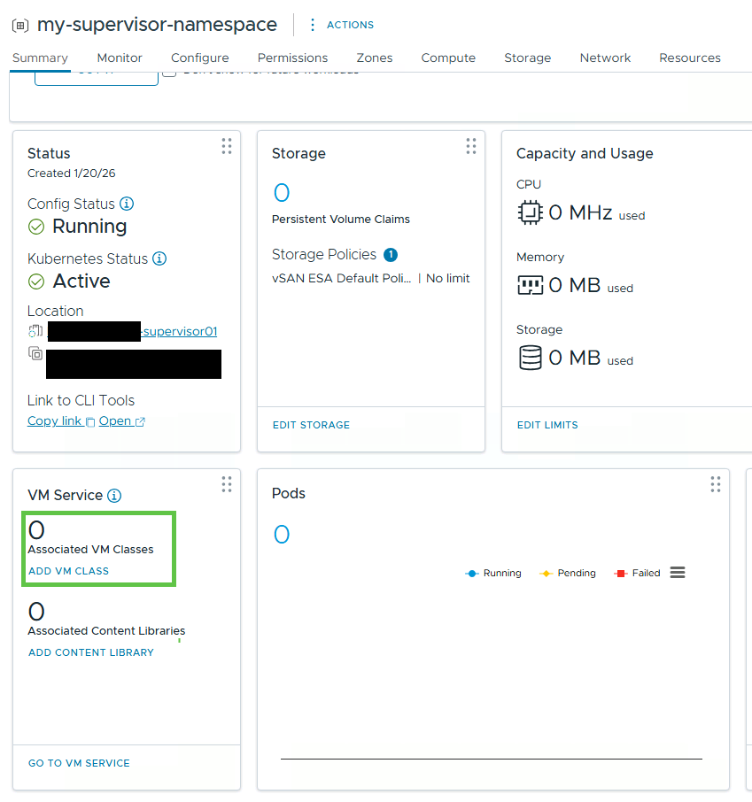

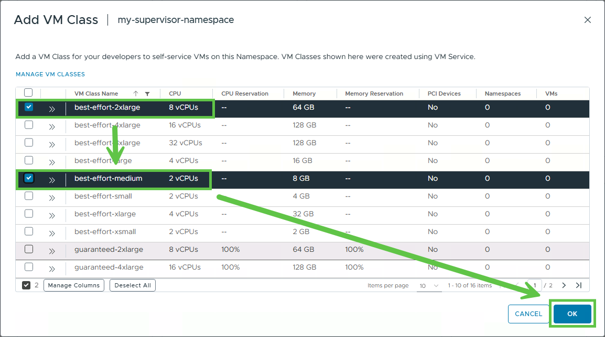

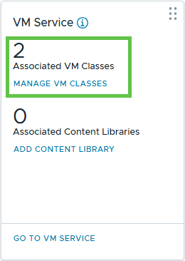

 
 

### 5. Assign Permissions (optional)
If the user managing the namespace are not part of the administrators group, it is necessary to add them to the newly created namespace with the "Namespace Owner" role to allow them to deploy VKS clusters.

1. On the new namespace, select the permissions tab.
2. On the **Add Permission" window
   * Select the Domain
   * Select the user or group
   * Assign the **Namespace Owner** role
   * Select **Propagate to Children**
3. Ensure the user/group is listed in the permissions with the correct role.

Images

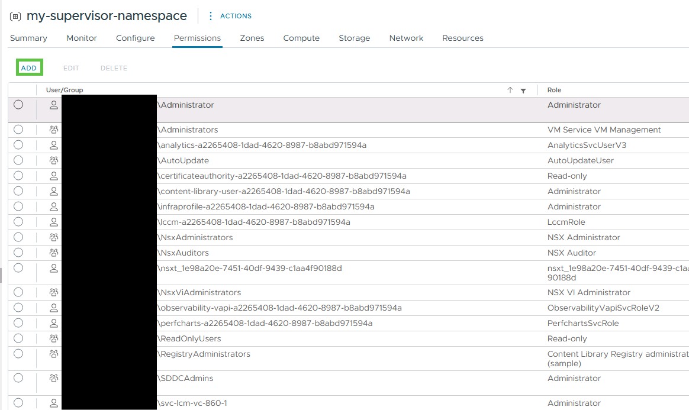

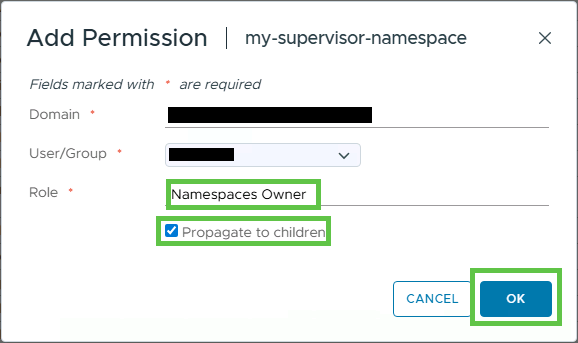

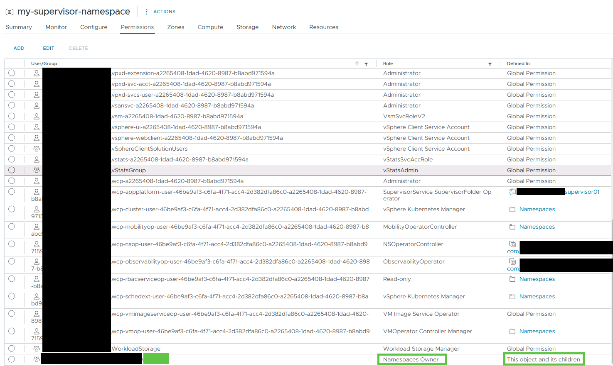

 
 